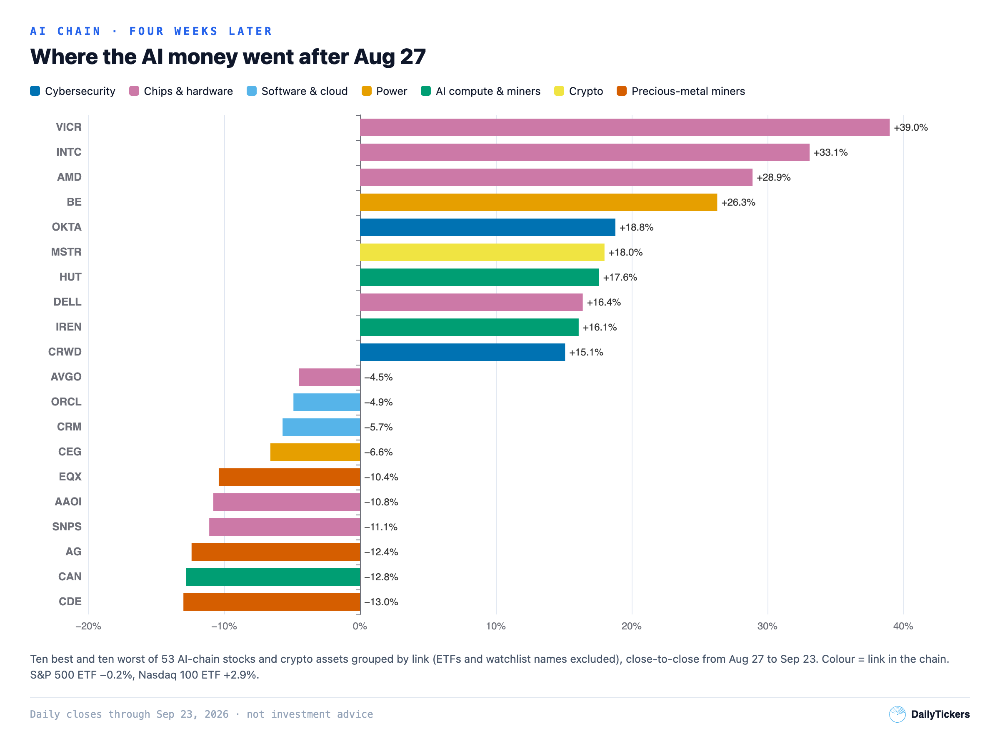
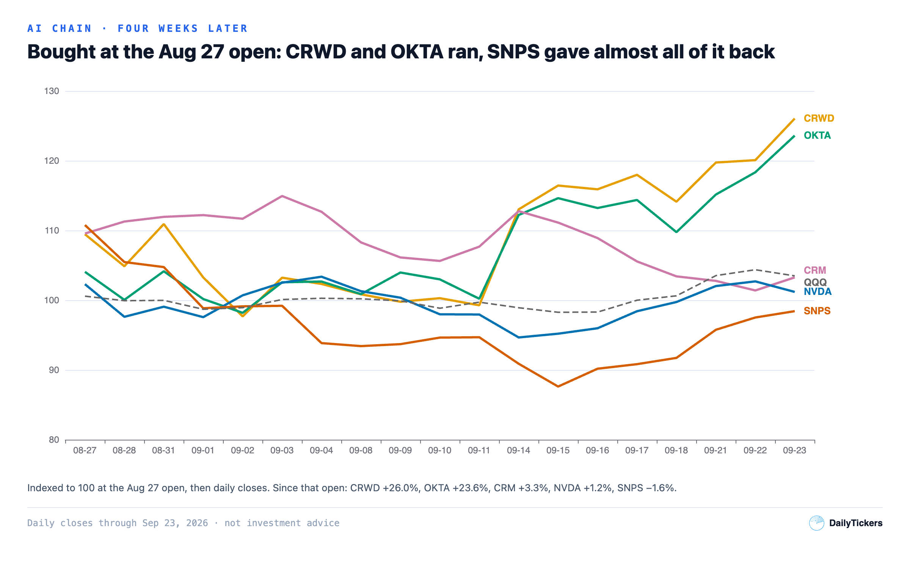
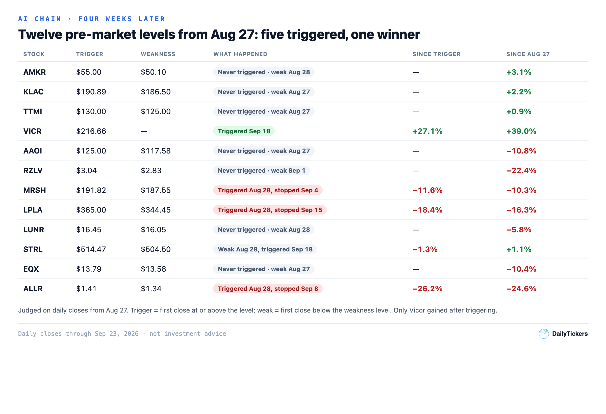
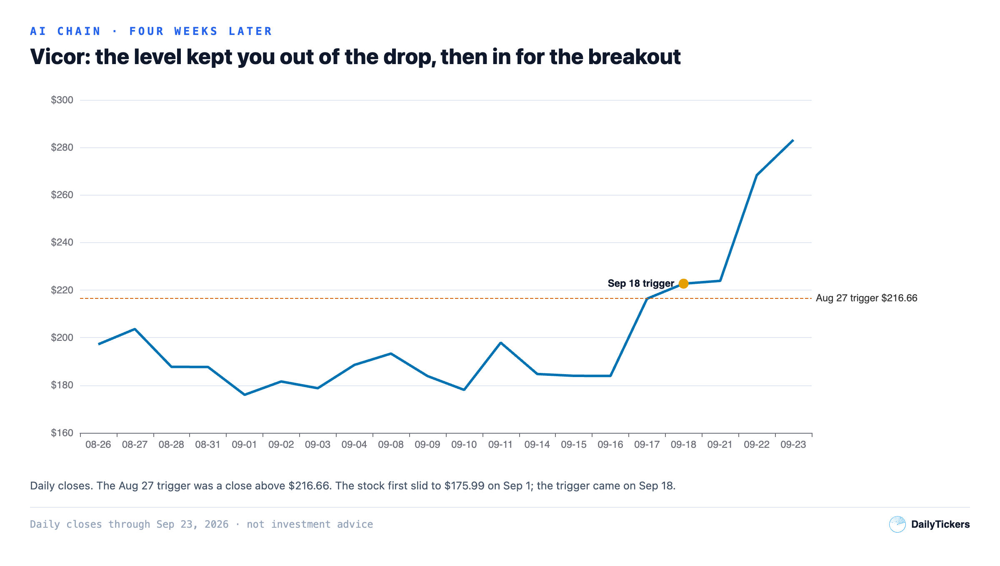

# The AI Chain, Four Weeks After Nvidia: What Held, What Faded

*24 September 2026 · daily closes from 24 August to 23 September*

On 27 August, the morning after Nvidia's results, we tracked 57 stocks and 8 ETFs across the AI chain: chips, cybersecurity, software, power, AI data centres, crypto miners, gold miners.

We made calls that morning. Here is how each one aged, judged on closing prices.

Our pre-market levels did not pick the winners. Twelve stocks had a trigger price. Five triggered, and only one of those five made money afterwards. Where the levels helped was in keeping us out: all seven stocks that never triggered also broke their weakness level, and staying out cost little.

## The market barely moved. The chain did.

Since the 27 August close, the S&P 500 ETF is **−0.2%** and the Nasdaq 100 ETF **+2.9%**. Inside the AI chain the gaps were large.

- **Cybersecurity kept working.** CrowdStrike **+15.1%**, Okta **+18.8%**, Zscaler **+14.5%**.
- **Some chips and hardware ran hard.** Vicor **+39.0%**, Intel **+33.1%**, AMD **+28.9%**, Dell **+16.4%**, Micron **+14.6%**.
- **Software faded.** Salesforce **−5.7%**, Oracle **−4.9%**. The software ETF is **−2.0%**.
- **Power was mixed.** Constellation **−6.6%**, but GE Vernova (**−0.2%**) and Vistra (**−1.2%**) were flat, and Bloom Energy rose **+26.3%**.
- **Gold and silver miners fell.** Coeur **−13.0%**, First Majestic **−12.4%**, Equinox **−10.4%**.

## "Don't chase the opening jump": it depends where you started

Nvidia, CrowdStrike, Okta and Salesforce had reported the night before. CrowdStrike was our cleanest reaction that morning. The general advice was: don't pay a big opening jump without a few days of calm first.

| Stock | Jump on Aug 27 | Since Aug 27 **open** | Since Aug 27 **close** |
|---|---|---|---|
| CRWD | +20.5% | **+26.0%** | +15.1% |
| OKTA | +28.6% | **+23.6%** | +18.8% |
| PANW | +12.8% | +9.7% | +2.7% |
| NOW | +10.0% | +7.9% | +1.7% |
| CRM | +22.6% | +3.3% | −5.7% |
| NVDA | +8.7% | +1.2% | −1.1% |
| TENB | +11.8% | −0.3% | −3.7% |
| SNPS | +13.4% | −1.6% | −11.1% |

Bought at the 27 August open, six of these eight stocks are up today. Bought at that day's close, after the jump, Salesforce, Nvidia, Tenable and Synopsys are down. So the advice protected people who would have bought late in the day.

Waiting cost nothing on CrowdStrike and Okta either, as long as you were willing to watch the stock drop about 10% without buying. By the 2 September close, CrowdStrike was **10.8%** and Okta **5.6%** below their 27 August close. Then both went sideways for seven sessions, around their opening price that day. From 2 to 11 September, CrowdStrike closed between **$203.42** and **$214.97** (27 August open: **$208.25**); Okta between **$163.15** and **$172.74** (open: **$166.15**). Even bought at the top of that range, CrowdStrike is up **+22.1%** and Okta **+18.9%**.

## The "don't chase" basket: right on average, wrong on Intel and AMD

We put twelve stocks in a basket of "bounces still below resistance": stocks that had rallied in sympathy but had not yet cleared their recent highs. We said not to chase them.

As a group, they rose **+8.8%** on average (each stock counted the same), against **+5.0%** for the semiconductor ETF. But three names did most of that. Eight of the twelve lagged the ETF, and the middle stock rose only **+2.9%**.

Intel and AMD were real misses. We had no level for them, and their worst close after 27 August was only **−3.4%** and **−4.3%**. There was no serious pullback to wait for. Vicor was different: we gave it a repair level, a price above which the chart would be fixed ($216.66), and that level worked.

All three made most of their gains late. At the 16 September close, Intel was up only **+9.7%**, AMD **+7.5%**, and Vicor was still **−9.7%**.

If you don't own them: a 30% rise in four weeks is not an entry. We have no validated level on Intel or AMD.

## Twelve levels, five triggered, one winner

- **Seven never triggered, and all seven broke their weakness level.** Four kept falling: RZLV **−22.4%**, AAOI **−10.8%**, Equinox **−10.4%**, LUNR **−5.8%**. Three drifted slightly higher: AMKR **+3.1%**, KLAC **+2.2%**, TTMI **+0.9%**. Staying out cost little.
- **Three triggered on 28 August and then failed.** MRSH, LPLA and ALLR each closed below their weakness level a few sessions later. From trigger to exit they lost **3.6%**, **7.8%** and **11.3%**. After that exit they kept falling: MRSH another **8.3%**, LPLA **11.5%**, ALLR **16.8%**. For MRSH the trigger was only partial: its second level was never reached on a close.
- **STRL triggered late and went nowhere.** It had already broken its weakness level on 28 August, triggered on 18 September, and is **−1.3%** since.
- **Vicor triggered late and paid.** The trigger was a close above **$216.66**.

Vicor first fell to **$175.99** on 1 September, and the rule kept us out. It closed above the trigger on 18 September and is up **27.1%** since then.

## Levels to watch until 22 October

These are levels to watch, not trade ideas. We check them again at the 22 October close.

- **CrowdStrike ($262.49).** A close below **$250.06** (its 22 September close) would put the cybersecurity story in doubt.
- **Synopsys ($413.06).** The 27 August jump is almost gone. A close back above **$464.89** would show buyers stepping back in.
- **Nvidia ($225.51) and Salesforce ($237.58).** Both trade below their 27 August close (**$227.98** and **$252.05**). Getting back above it is the first test.
- **Vicor ($283.16).** A close back below **$216.66** would undo the breakout. For Intel and AMD, there is no level.

The backdrop also changed. On 23 September the US 10-year Treasury yield closed at **5.11%**, its highest close since July 2007. Over the same four weeks, software fell and cybersecurity rose. We can't say how much of that gap comes from rates.

## Two rules worth keeping

1. **A level is a filter, not a forecast.** It tells you when an idea becomes true and when it becomes false. It does not tell you the stock will go up.
2. **The weakness level matters most right after a trigger.** MRSH, LPLA and ALLR triggered, failed, and kept falling. The exit mattered more than the entry.

*How we measured this: daily closing prices only, from 24 August to 23 September 2026. Closes cut both ways. They avoid false triggers (RZLV and TTMI touched their levels intraday without closing above), but they also delay exits (MRSH broke its level intraday three sessions before the close that counted). Volume and intraday average price are not tested. The list came from a single earnings morning, not a neutral sample, and four weeks is too short to judge a long-term thesis. This is information and education, not financial advice. You can lose money.*
